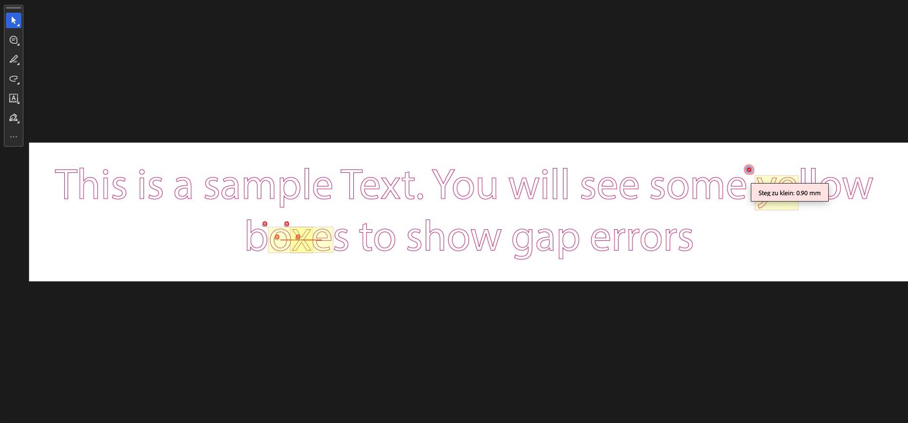

# python-plot-gap-check

Analyze PDF files for gaps and font sizes too small for vinyl cutting / plotter machines.

---

## English

### What it does

`gap_check.py` scans a PDF for two common issues that prevent vinyl cutters and plotter machines from processing a file:

- **Gaps too small** – contours that are closer than 1 mm to each other (the machine cannot cut between them)
- **Font sizes too small** – text that is too fine to be cut reliably

The script creates an annotated copy of your PDF with all problem areas highlighted in color:

- 🔴 **Red line + yellow overlay** → gap between paths smaller than the minimum
- 🟠 **Orange overlay** → text element with font size below the minimum

Hovering over an annotation shows the exact measurement (e.g. *"Gap too small: 0.5 mm"*).

### Requirements

```bash
pip install pymupdf
```

Or with a virtual environment (recommended if you have multiple Python projects):

```bash
python -m venv venv
source venv/bin/activate      # Windows: venv\Scripts\activate
pip install pymupdf
```

### Usage

```bash
# Default thresholds (1.0 mm gap, 6.0 pt font)
python gap_check.py input.pdf

# Custom thresholds
python gap_check.py input.pdf --min-gap 1.0 --min-font 6.0
```

The output file is saved as `input_geprueft.pdf` in the same directory.

### Arguments

| Argument | Default | Description |
|---|---|---|
| `input` | – | Path to the input PDF |
| `--min-gap` | `1.0` | Minimum gap between contours in mm |
| `--min-font` | `6.0` | Minimum font size in pt |

### Preview



### Sample files

| File | Description |
|---|---|
| `sample.pdf` | Example input file |
| `sample_proof.pdf` | Example output with gap errors highlighted |

---

## Deutsch

### Was es macht

`gap_check.py` analysiert ein PDF auf zwei häufige Probleme, die Plottmaschinen beim Schneiden von Plotfolie blockieren:

- **Zu kleine Stege** – Konturen, die weniger als 1 mm voneinander entfernt sind (die Maschine kann dazwischen nicht schneiden)
- **Zu kleine Schriften** – Text, der zu fein für einen sauberen Schnitt ist

Das Script erstellt eine annotierte Kopie deines PDFs, in der alle problematischen Stellen farbig markiert sind:

- 🔴 **Rote Linie + gelbe Überlagerung** → Steg zwischen Pfaden kleiner als der Mindestwert
- 🟠 **Orange Überlagerung** → Textelement mit zu kleiner Schriftgröße

Beim Hovern über eine Markierung wird der genaue Messwert angezeigt (z. B. *„Steg zu klein: 0,5 mm"*).

### Voraussetzungen

```bash
pip install pymupdf
```

Oder mit einem virtuellen Environment (empfohlen bei mehreren Python-Projekten):

```bash
python -m venv venv
source venv/bin/activate      # Windows: venv\Scripts\activate
pip install pymupdf
```

### Verwendung

```bash
# Standardwerte (1,0 mm Steg, 6,0 pt Schrift)
python gap_check.py eingabe.pdf

# Eigene Schwellwerte
python gap_check.py eingabe.pdf --min-gap 1.0 --min-font 6.0
```

Die Ausgabedatei wird als `eingabe_geprueft.pdf` im selben Ordner gespeichert.

### Argumente

| Argument | Standard | Beschreibung |
|---|---|---|
| `input` | – | Pfad zur Eingabe-PDF |
| `--min-gap` | `1.0` | Mindestabstand zwischen Konturen in mm |
| `--min-font` | `6.0` | Mindest-Schriftgröße in pt |

### Vorschau


### Beispieldateien

| Datei | Beschreibung |
|---|---|
| `sample.pdf` | Beispiel-Eingabedatei |
| `sample_proof.pdf` | Beispiel-Ausgabe mit markierten Steg-Fehlern |